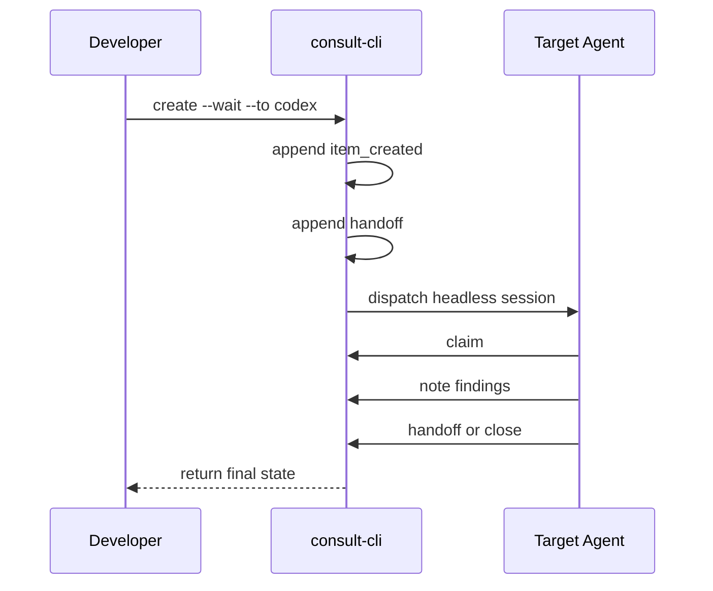

# consult-cli (beta)

Local append-only baton board for coordinating work between AI coding
assistants. When you `create` or `handoff` an item, the CLI dispatches a new
agent session to pick it up. Works out of the box with Claude Code, Codex, and
Kiro.

## Status

`consult-cli` is in beta.

- The core baton flow is working and tested locally.
- The CLI surface may still evolve as real multi-agent workflows shake out.
- Dispatch behavior depends on the target local agent CLI behaving well in headless mode.

## Why

AI coding assistants (Claude Code, Codex, Kiro, Cursor, etc.) run in isolated
sessions. When one agent needs a second opinion — a review, a consult, a
question — there's no standard way to hand work over with context and get a
structured response back. consult-cli is that handoff layer.

- **Single owner at a time** — no confusion about who's working on what
- **Append-only event log** — full audit trail, no editable state
- **Auto-dispatch** — `create` and `handoff` spawn a new agent session
- **`--wait`** — block until the dispatched agent finishes, zero polling
- **`--json` everywhere** — machine-readable for scripts and wrappers

## How It Flows



## Quickstart

```bash
git clone https://github.com/mundabra/consult-cli.git
cd consult-cli

# Run the example (no dispatch — simulates both agents locally)
./examples/two-agent-review.sh

# Or dispatch to a real agent (requires claude, codex, or kiro installed)
./consult create --wait --kind consult --from me --to codex \
  --title "Ping" --body "Reply with a note saying hello, then close."

./consult create --wait --kind consult --from me --to kiro \
  --title "Ping" --body "Reply with a note saying hello, then close."
```

## Commands

| Command | Description |
|---------|-------------|
| `create` | Create an item and hand it off (auto-dispatches) |
| `claim` | Claim an item you currently own |
| `note` | Append a note with findings or context |
| `handoff` | Pass an item to another agent |
| `inbox` | List open items owned by an agent |
| `show` | Show derived state and full event history |
| `close` | Close an item with a summary |

Global flags: `--json` (machine-readable output), `--root <path>` (override storage root)

## Dispatch

`create` and `handoff` automatically spawn a new session for the target agent.
Built-in agents are auto-detected:

| Agent | Command | Detection |
|-------|---------|-----------|
| `claude` | `claude -p` | `which claude` |
| `codex` | `codex exec` | `which codex` or `/Applications/Codex.app` |
| `kiro` | `kiro-cli chat --no-interactive --trust-all-tools` | `which kiro-cli` |

Use `--wait` to block until the dispatched agent finishes and return the final state:

```bash
./consult --json create --wait --kind review \
  --from claude --to codex \
  --title "Review auth module" --body "Check for race conditions"
```

Use `--no-dispatch` to log without spawning (for scripts, tests, or handing back):

```bash
./consult handoff <item-id> --from codex --to claude \
  --summary "Review complete" --no-dispatch
```

## Custom Agents

Create `~/.consult-cli/agents.json` to add agents or override built-ins:

```json
{
  "agents": {
    "gemini": { "command": ["gemini", "--prompt"] },
    "reviewer": { "command": ["claude", "-p", "--append-system-prompt", "You are a code reviewer."] }
  }
}
```

See `agents.example.json` for more examples. Custom mappings override built-in
detection. Unknown agent names without a config entry do not dispatch.

## Storage

- Default root: `~/.consult-cli`
- Override: `CONSULT_ROOT` env var or `--root /path`
- Each item: `items/<item-id>/events.jsonl`
- Dispatch logs: `items/<item-id>/dispatch-<uuid>.log`

## Integration

### Claude Code

Copy `SKILL.md` to `~/.claude/skills/consult-cli/SKILL.md` and adjust the CLI
path to your clone location. The skill teaches Claude Code when and how to use
consult-cli, including `--wait` for dispatch.

### Codex

Works out of the box. `consult` dispatches to `codex exec` with
`--sandbox workspace-write` and grants access to the consult CLI directory and
storage root.

### Kiro

Works out of the box. `consult` dispatches to `kiro-cli chat --no-interactive
--trust-all-tools` when `kiro-cli` is on PATH.

### Other Assistants

Add an entry to `agents.json` with the command that starts a headless session
with a prompt. The CLI appends the prompt as the last argument. See
`agents.example.json` for the pattern.

## Adding Built-In Agents

To add a new built-in agent (via PR):

1. Add a branch to `built_in_agent_command()` in `consult_cli.py`
2. Add dispatch flags to `build_dispatch_command()` if the agent needs special args
3. Add a test to `test_consult_cli.py`

## Corrupt Log Handling

If an `events.jsonl` line is malformed JSON, the CLI exits with a clear error
including the file path and line number. It does not silently ignore or repair
corrupted data.

## Tests

```bash
python3 -m unittest -v test_consult_cli.py
```

## License

MIT
