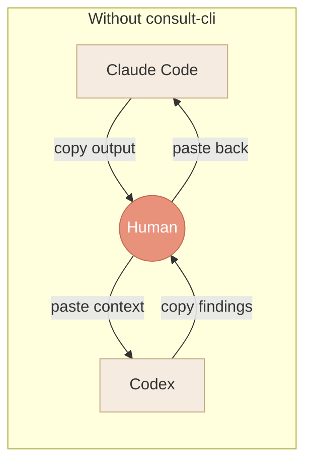
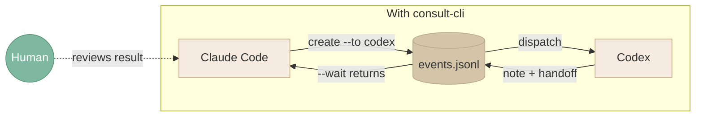
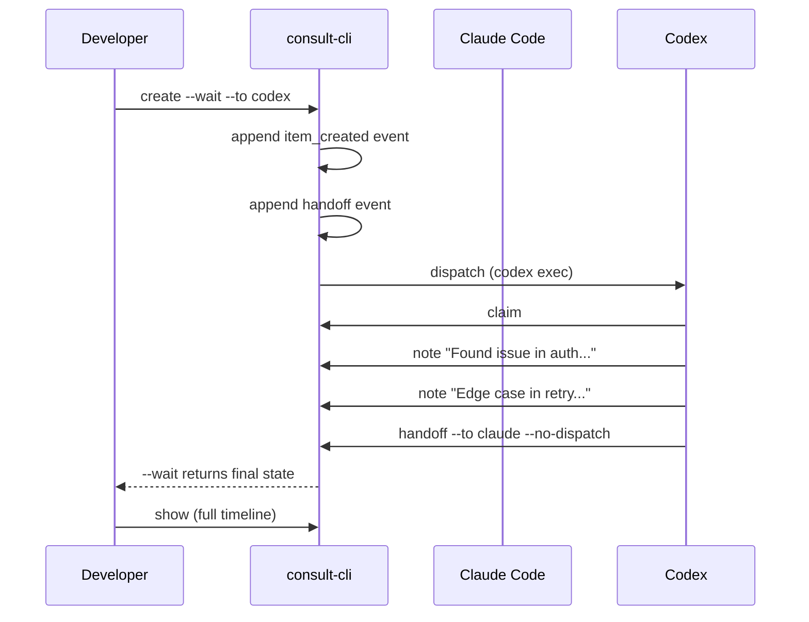
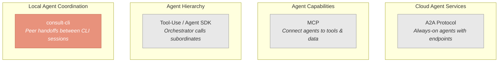
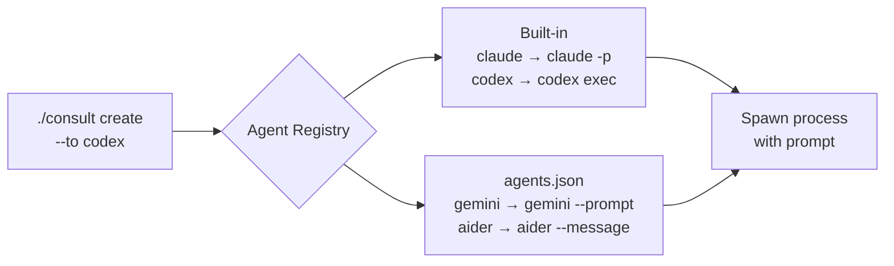

# Diagrams for "Why I Built consult-cli"

## Diagram 1: The Problem — Human as Message Router

## Diagram 2: The Solution — Agents Consult Directly

## Diagram 3: Item Lifecycle

## Diagram 4: Protocol Layer Comparison

## Diagram 5: Agent Registry & Dispatch

## Usage Notes

- Diagrams 1 & 2 work as a side-by-side pair (before/after)
- Diagram 3 is the most important — shows the full lifecycle
- Diagram 4 should be simple, not a full comparison matrix
- Diagram 5 is optional — only if the README needs a dispatch explainer
